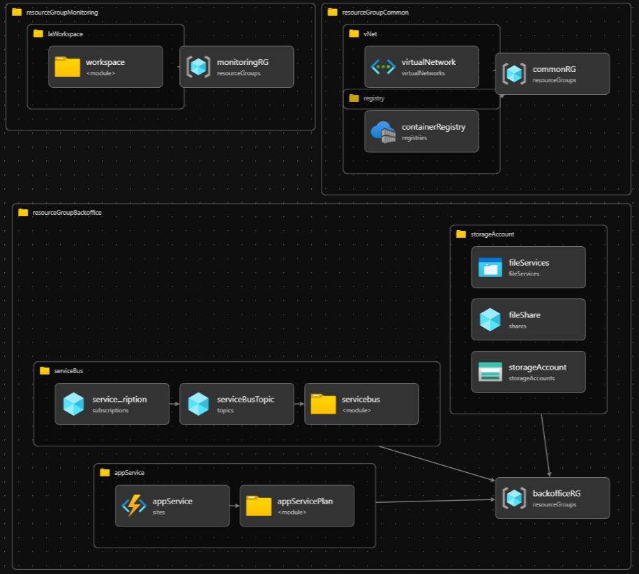

# Solution Architecture

## 1. Overview
This project represents an Infrastructure as Code (IaC) implementation, scripted using Azure Bicep, for a set of applications and services defined in on-premises environments. Some of the main objectives considered:
- On-premises to cloud migration
- Creating a fully automated and repeatable cloud infrastructure
- Ensuring a secure and monitored environment
- Facilitating scalability and maintenance

## 2. Architectural Design

The infrastructure includes the following main components:
- App Service for website hosting
- Container Registry for Docker images
- Service Bus for asynchronous messaging
- Storage Account for static and dynamic data storage
- Virtual Network for isolation and security
- Log Analytics for monitoring and logging
- Separate Resource Groups for:
  - Back-office components
  - Common resources
  - Monitoring resources

## 3. Design Decisions

Technology Choices:
- Bicep for IaC instead of ARM templates for clearer syntax and better maintainability
- Modular organization of Bicep code for reusability (`modules/resources/` and `modules/resource-groups/`)
- Git-based repository
- Azure Repo for hosting the project
- Azure DevOps Pipelines for the implementation of a CI/CD workflow

Resource Organization:
- Logical separation into distinct resource groups for back-office, common, and monitoring
- Resource-level modularization for flexibility and reuse
- Extensive parameterization for multi-environment support

Security Considerations:
- Network-level isolation using Virtual Networks
- PaaS services with private endpoints where possible
- Managed Identities for service-to-service authentication

## 4. Deployment Workflow

CI/CD Pipeline Overview:
- Pipeline defined in `deploy/azure-pipelines.yml`
- Automatic validation of Bicep templates
- ARM template generation and validation
- Sequential deployment across environments (DEV -> TEST -> PROD)

Deployment Sequence:
1. Bicep template validation and build
2. Resource Groups deployment
3. Common resources and networking deployment
4. Application components deployment
5. Monitoring and alerting configuration

Idempotency ensured through:
- Use of conditional states in Bicep
- Consistent parameterization
- Pre-deployment validations

## 5. Scalability and Performance

Scaling Methods:
- Metrics-based auto-scaling configured for App Service
- Service Bus with workload-based auto-scaling
- Storage Account with redundancy and geo-replication
- Container Registry with replication for performance

Performance Optimizations:
- CDN for static content
- App Service level caching
- Premium tier for critical services
- Network optimizations through Virtual Network

## 6. Maintenance and Monitoring

Monitoring Tools:
- Centralized Log Analytics Workspace for all resources
- Application Insights for application telemetry
- Custom dashboards for operational visibility
- Azure Monitor for system metrics

Backup and Recovery:
- Automated backup for App Service
- Geo-replication for Storage Account
- Documented Disaster Recovery plan
- Point-in-time restore for critical data

## 7. Challenges and Limitations

Known Issues and Resolutions:
- Resource dependencies require specific deployment order
  - Resolved through explicit dependencies in Bicep
- Complexity in secrets management
  - Implemented Key Vault for centralization
- Considerable deployment time for complete infrastructure
  - Optimized through parallelization where possible

Future Improvements:
- Implementation of Azure Front Door for global traffic management
- Extension of monitoring with custom alerts
- Complete automation of disaster recovery processv
- Implementation of infrastructure testing

## 8. References

- [Azure Bicep Documentation](https://learn.microsoft.com/en-us/azure/azure-resource-manager/bicep/)
- [Azure Well-Architected Framework](https://learn.microsoft.com/en-us/azure/architecture/framework/)
- [Azure Solution Architectures](https://learn.microsoft.com/en-us/azure/architecture/browse/)
- [Bicep Best Practices](https://learn.microsoft.com/en-us/azure/azure-resource-manager/bicep/best-practices)
- Project Repository: [IaCBicep](https://github.com/MariusM26/IaCBicep)
